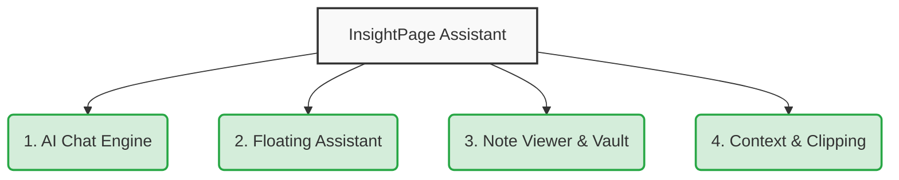
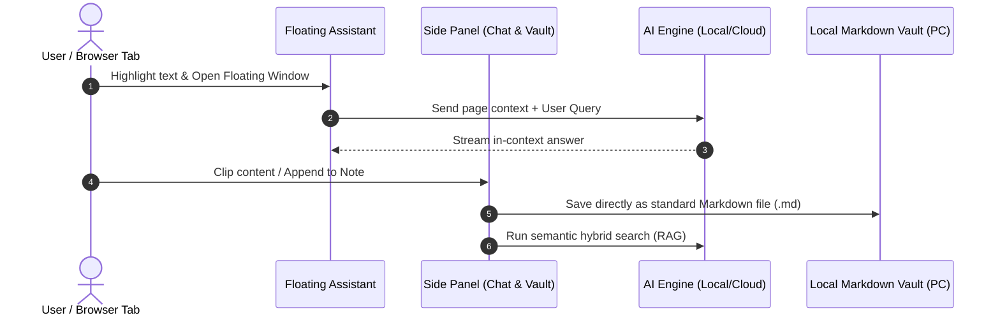
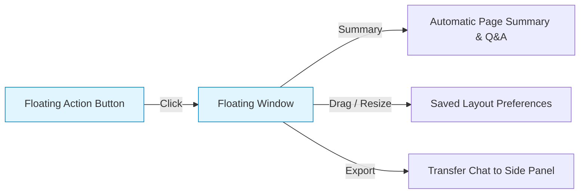
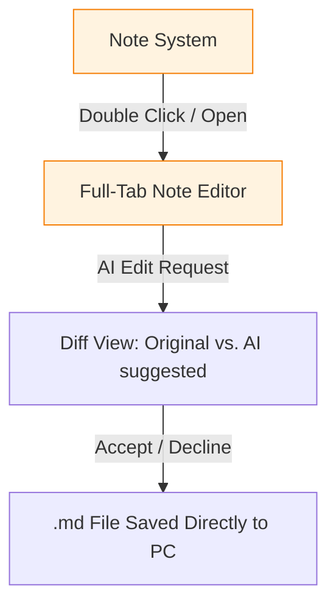

# InsightPage Application User Guide

Welcome to InsightPage! This guide introduces you to the core features of your intelligent browser assistant, helping you turn web browsing, research, and note-taking into a seamless, AI-powered workflow.

---

## System Overview & Information Flow

Below are diagrams illustrating how InsightPage organizes its functionalities into four core pillars and how data flows between your browser, the AI, and your local files.

### 1. The Four Core Pillars of InsightPage

### 2. Information Flow Diagram

---

## 1. AI Chat Engine

InsightPage's side panel features a flexible, powerful chat interface that connects directly to local or cloud-based AI models.

### Chat Modes

* **Standard Chat Mode (`chat`)**: Converse with the AI using general knowledge and current conversation history.
* **Web Mode (`web`)**: The AI optimizes your query, performs a live search, visits the top relevant pages to extract their main content, and provides a fully-sourced, up-to-date answer.
* **Page Mode (`page`)**: The AI reads the active tab's content (including PDFs!) to let you summarize, ask questions, or run analysis instantly.

### Hybrid RAG Search

Type `/r` before a query (e.g., `/r key takeaways from project alpha`) to run a **Hybrid Search**. InsightPage combines:

* **Keyword Search (BM25)**: Matches exact keywords in notes and chats.
* **Semantic Search (Embeddings)**: Matches the underlying meaning and concepts of your query.
* **MMR Reranking**: Re-sorts results to maximize relevance and reduce redundancy before feeding context to the LLM.

### Smart Dispatcher

When given complex tasks, the `smart_dispatcher` acts as your personal AI agent. It automatically coordinates multiple actions in a single step, such as:

1. Searching the web.
2. Fetching full article content.
3. Generating structured summaries.
4. Saving findings directly to your Note Viewer.

---

## 2. Floating Assistant

The **Floating Assistant** brings the power of AI directly into your webpage, letting you interact with content seamlessly without opening the side panel.

* **Floating Action Button (FAB)**: A circular button that floats on the edge of your browser. You can drag it vertically to keep it out of your way.
* **Floating Window**: Click the FAB to open a lightweight, movable, and resizable overlay window.
* **In-Context Actions**:
  * **Automatic Summaries**: Shows a quick page overview, tags, and sample questions when opened.
  * **Seamless Chatting**: Ask questions directly about the page you are reading.
  * **Quick Transfers**: Clear the chat with the **Refresh** button, or transfer the conversation to the main side panel with **Open in Side Panel**.

For detailed setup and quick controls, check out the built-in guide:
👉 **[[Using the Floating Assistant]]**

---

## 3. Note Viewer & Personal Vault

The note-taking system serves as your second brain, offering full Markdown compatibility and native local-file integration.

* **Local Markdown Vault**: Connect folders on your PC directly using the **File System Access API**. Notes are saved as standard `.md` files in real-time, functioning as a lightweight Obsidian-like setup. No IndexedDB cache layer is used in this mode, preventing write amplification and ensuring your local directories remain the single source of truth.
* **Wikilinks & Deep Internal Linking (`[[Note Title]]`)**:
  - Full Wikilink syntax support across notes, popovers, and chat responses.
  - Type `[[Note Title]]` to link to any note in your vault. Clicking a Wikilink instantly navigates to that note—or automatically creates a new note with that title if it does not exist yet.
  - Use `![[Note Title]]` for **transclusion/embedding**, embedding and rendering the contents of another note inline within your current document.
* **Note Mentions (`@[Note Title]`) & Context Injection**:
  - Type `@` in the chat input to search and attach specific notes directly into the AI context window.
* **Select Notes for Q&A**: Select multiple notes from your Vault list and click **Start Q&A** to pre-fill note mentions (`@[Note Title]`) in the chat bar. The AI will answer queries using strictly the selected notes.
* **Full-Page Tab Editor**: Open any note in a new browser tab for a spacious, distraction-free editing layout complete with adjustable font sizes.
* **AI-Powered Note Editing & Diff View**:
    1. Open your note in a new tab.
    2. In the side panel, ask the AI to modify the note (e.g., *"Make this summary more concise"*, *"Translate to German"*).
    3. View the real-time **Diff View** in your note tab, highlighting additions and deletions side-by-side.
    4. Click **Accept** to commit the changes directly to your file, or **Decline** to keep the original.

To see all supported Markdown renderings, including tabs, KaTeX math formulas (`$ ... $`, `$$ ... $$`), syntax-highlighted code blocks, Chart.js charts, and Mermaid diagrams, see:
👉 **[[Rendering Showcase]]**

---

## 4. Context Window & Smart Clipping

The input context bar and background processing allow you to easily collect information from around the web.

* **Context Window Integration**: Drag files, images, or enter specific URLs into the chat's input context window. URLs are automatically scraped and used as additional prompt context.
* **Smart Web Clipper**:
  * Highlight any text on a webpage, right-click, and select **Add to Note** to append the text to your current popover note.
  * Use the context menus to quickly capture insights without breaking your browsing momentum.
* **Smart Weekly Notes**:
  * Instantly create or open weekly review files with predefined action templates.
  * Highlight text on any page, right-click, and select **Add to Weekly Note** to instantly append clean, sanitized web links (stripping analytical and tracking parameters) alongside your captured snippets.
  * Customize action items and path folders under **Settings -> Page Mode Settings**.

---

## 5. Advanced & Multi-Modal Capabilities

InsightPage is equipped with advanced underlying features to support multi-modal assets, zero-overhead storage, and deep language processing.

### Multimodal Image & Vision Model Support

* **Vision-Ready Uploads**: Upload standard image formats (`.png`, `.jpg`, `.jpeg`, `.webp`, `.gif`) using the chat input interface.
* **Automatic Resolution & Quality Optimization**: To keep network payloads lightweight and prevent API timeouts, large images (longer side > 1568px) are automatically scaled down while maintaining aspect ratio. Large PNG images are automatically optimized to JPEG (90% quality with white background fallbacks) before dispatch.
* **Native Vision Payloads**: Images are stripped from standard prompt text and sent as highly structured, OpenAI-compatible `image_url` vision payloads. This provides plug-and-play support for multi-modal local hosts (such as LM Studio) and cloud endpoints (such as GPT-4o).

### Intelligent PDF Operations & Language Auto-Detection

* **Dynamic Language Detection**: InsightPage uses an intelligent language detection engine. When downloading notes or chat summaries as PDFs, it auto-detects standard language families—including English, Spanish, German, French, Simplified Chinese (`zh-CN`), Traditional Chinese (`zh-TW`), Japanese, and Korean.
* **One-Click PDF Generation**: No more manual dropdown menu configurations or nested option panels. The note action menu features a direct, one-click PDF download button that automatically pairs the correct system fonts (and runs high-performance regex checks for CJK rendering) based on the note's text content.
* **Unified Background PDF Text Extraction**: When analyzing active PDF tabs, text parsing is delegated dynamically to background service worker scripts and offscreen document chunks. This prevents heavy third-party parsing engines (such as `pdfjs-dist`) from bloating the main frontend UI bundle.

### Theme-Aware Design & Floating Window Polish

* **Unified Custom Theme Palette Mapping**: When using a custom or active theme (like Moss, Night Sepia, or Dark), the entire interface—including dropdown selectors, settings panels, hover quick action menus, and modal dialogs—adapts perfectly. Custom color picker modals are lazy-loaded on-demand to keep initial extension boot speed lightning-fast.
* **Theme-Aware Floating Tooltips**: Floating action windows and icon button tooltips leverage specialized CSS variables (`--tooltip-bg`, `--tooltip-fg`, and `--tooltip-border`) to guarantee that overlays match your selected persona theme exactly, rather than defaulting to standard black styling.
* **Hover-Triggered Action Overlays**: Quick-action controls (such as web search mode switches) stay out of your way. They are hidden dynamically using smart tailwind group transitions, appearing instantly on container hover or input focus.

---

## 6. Privacy, Security & Data Ownership

InsightPage is designed from the ground up with a **100% Privacy & Local-First Architecture**:

* **Zero Data Collection**: InsightPage does not collect, track, aggregate, or sell any user data, search queries, browsing history, or notes.
* **No Middleman Server & No Login**: There are no developer servers, no proxies, no registration forms, and no user logins.
* **Direct Client-to-API Communication**: All communications occur **directly from your browser to your configured AI provider's API endpoint** (e.g., OpenAI, Gemini, Groq, OpenRouter) or local model server (e.g., Ollama, LM Studio).
* **Local Key & Credential Storage**: Your API keys and endpoint settings are stored locally in your browser and are never sent anywhere else. Your model endpoints and data usage remain entirely your own responsibility and business.

---

## 7. Configuration & Settings Summary

InsightPage is designed to be highly configurable. Access settings by clicking your persona's avatar in the top-left corner.

* **API & LLM Access**: Connect to cloud APIs (OpenAI, Gemini, Groq, OpenRouter) or local servers (Ollama, LM Studio, or OpenAI-compatible custom endpoints). InsightPage is a **Bring Your Own Key (BYOK)** extension—you provide your own API keys or local server endpoints in **Settings -> API Access**.
* **Model Parameters**: Fine-tune generation parameters (Temperature, Max Tokens, Top P, and Presence Penalty) or manage which models appear in your active list.
* **AI Personas**: Select or create custom personalities (like Ein, Warren, or Jet) by uploading custom avatars and customizing system prompts.
* **Themes & Customization**: Instantly switch between predefined themes (Paper, night-sepia, Moss, Light, Dark) or create a Custom Theme by specifying colors for text, background, accents, and links.
* **Text-to-Speech (TTS)**: Let the AI read its responses out loud using your browser's built-in voices or advanced local TTS frameworks.
* **Data Portability**: Go to the Share icon in the header to export your entire extension data as a secure `.zip` backup, or export individual chat logs as `.md`, `.txt`, `.json`, or `.png` images.

---

## 8. Troubleshooting Quick-Fixes

* **AI fails to respond**: Verify your internet connection for cloud models, or ensure your local Ollama/LM Studio server is running on the correct port (e.g., `http://localhost:11434/v1`).
* **RAG Search returns empty results**: If in **Manual Mode**, remember to open Embedding Management in the main menu and click **Rebuild** or **Update** to index your notes and chats.
* **File System directory disconnects**: Browsers require user permission to access local folders after a restart. Go to the Note System and click "Reconnect" or select your folder again to restore access.
